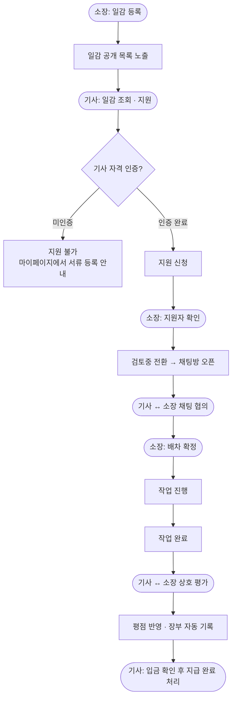
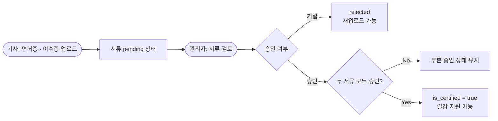
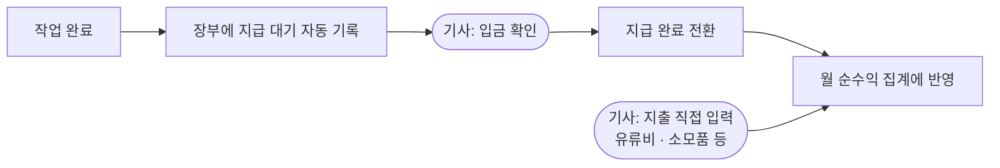

# Diggo — 굴착기 배차 플랫폼

배포: https://diggo-zr4b.vercel.app

---

## 1. 서비스 소개

굴착기 기사와 소장(현장 책임자)을 연결하는 배차 플랫폼입니다.

기존 중장비 플랫폼은 배차 중개까지만 합니다. 정산이나 기록은 여전히 수기입니다. Diggo는 배차 중개, 자격 인증, 전자장부를 한 곳에서 씁니다.

| 역할 | 주요 기능 |
|---|---|
| 기사 (driver) | 일감 조회·지원, 자격 인증, 전자장부 관리 |
| 소장 (manager) | 일감 등록, 지원자 관리, 기사 평가 |
| 관리자 (admin) | 자격 서류 심사, 회원 관리 |

---

## 2. 개발 배경

굴착기 기사로 직접 현장을 뛴 경험이 있습니다.

기사 쪽에서 보면, 경력이 있어도 나이가 어리면 일감을 못 잡는 경우가 많습니다. 작업을 마쳐도 대금이 밀리거나 아예 안 들어오는 일도 드물지 않습니다. 장부는 여전히 수기가 기본이라, 어느 날 일했는지 나중에 확인하는 것도 번거롭습니다.

소장 쪽도 마찬가지입니다. 경력을 속인 기사가 투입돼 현장 사고가 나는 건 실제로 있는 일입니다.

양쪽 다 상대를 검증할 방법이 없어서 생기는 문제입니다. 상호 평가와 자격 인증으로 서로를 확인하고, 전자장부로 수기 관리 문제를 해결하는 플랫폼을 만들었습니다.

---

## 3. 서비스 흐름

### 배차 플로우



### 자격 인증 플로우



### 전자장부 흐름



---

## 4. 핵심 기능

### 일감 등록 · 조회
- 일감 유형(토목/철거), 필요 장비, 작업 일자, 지급 금액 등록
- 카카오맵 주소 검색 + 지도 표시
- 마감일 지난 일감 자동 필터링

### 자격 인증 시스템
- 기사가 면허증·안전교육 이수증 이미지 업로드
- 관리자가 서류 검토 후 승인/거절
- 두 서류 모두 승인 시에만 `is_certified = true` → 일감 지원 활성화
- 재업로드 시 기존 서류 삭제 + 인증 초기화 (우회 방지)

### 지원 · 배차 관리
- 인증된 기사만 지원 가능 (API + UI 이중 차단)
- 5단계 상태 관리: `open → in_progress → completed → settled`
- 소장의 지원자 수락 시 1:1 채팅방 자동 생성

### 전자장부
- 작업 완료 시 지급 예정 금액 자동 기록
- 직접 지출 입력 (유류비, 장비 소모품 등)
- 월별 수입/지출/순수익 집계
- 지급 완료 기준 정산 (미수금과 실수령 분리)

### 관리자 대시보드
- 기사별 서류 목록 카드 UI + 모달 심사
- 승인/거절 처리 및 대기 건수 실시간 표시

---

## 5. 기술 스택

| 분류 | 기술 | 선택 이유 |
|---|---|---|
| Frontend | Next.js 16 (App Router), TypeScript, Tailwind CSS | `"use cache"` + cacheComponents로 공개 일감 목록 정적 캐싱, SSR/CSR 하이브리드 |
| Backend | Supabase (PostgreSQL, Auth, Storage, Realtime) | RLS로 역할별 접근 제어 선언적 처리, 인증·실시간 내장 |
| 클라이언트 상태 | Zustand | 유저 세션·role처럼 앱 전역에서 동기적으로 참조하는 값 전용 |
| 서버 상태 | TanStack Query v5 | 무한스크롤, 낙관적 업데이트, staleTime 기반 캐싱 |
| 지도 | 카카오맵 API | 주소 검색(Kakao 로컬 API) + 지도 렌더링(Kakao Maps SDK) |
| 패키지 매니저 | Bun | npm 대비 빠른 설치, Vercel 배포 환경 지원 |
| 배포 | Vercel | |

---

## 6. 아키텍처

```
클라이언트 (브라우저)
├── Server Components     — 초기 데이터 fetch, SEO
├── Client Components     — 상호작용, 실시간 업데이트
│   ├── Zustand           — 유저 세션 · 역할 전역 관리
│   └── TanStack Query    — 서버 상태 캐싱 · 무한스크롤
└── API Routes (app/api/) — 인증 필요 뮤테이션

Supabase (BaaS)
├── PostgreSQL            — 메인 DB (RLS 정책으로 역할별 접근 제어)
├── Auth                  — 이메일 로그인 · 세션 관리
├── Storage               — 자격 서류 이미지 업로드
└── Realtime              — 채팅 · 알림 구독
```

### 캐싱 전략

공개 일감 목록은 Next.js 16의 `"use cache"` + `cacheLife('seconds')`로 30초 캐싱합니다. 인증이 필요한 페이지는 `createClient()`에 `'use no-store'`를 선언해 자동으로 동적 처리됩니다. 클라이언트에서는 TanStack Query staleTime이 추가 캐싱을 담당합니다.

```
공개 페이지:  "use cache" (Next.js 16) → 서버 캐시
클라이언트:  TanStack Query staleTime → 클라이언트 캐시
인증 필요:   'use no-store' → 매 요청마다 fresh
실시간:      Supabase Realtime 구독
```

### 렌더링 전략

| 페이지 | 방식 | 이유 |
|--------|------|------|
| 일감 목록 | SSR + "use cache" | SEO + 30초 캐싱 |
| 일감 상세 | Partial Prerender | SEO, 공유 링크 미리보기 |
| 장부 / 마이페이지 | Dynamic (no-store) | 개인 데이터 |
| 채팅 | CSR + Realtime | 실시간 |

---

## 7. 기술 의사결정

### Supabase vs 직접 API 서버 구축

Supabase를 선택했습니다. Auth, Storage, Realtime을 별도로 구축하려면 개발 리소스가 크게 늘어납니다. 1인 개발로 MVP를 빠르게 완성하는 것이 우선이었고, RLS로 역할별 접근 제어를 선언적으로 처리할 수 있어 보안 코드를 줄일 수 있었습니다.

### Zustand + TanStack Query 병행

서버 상태와 클라이언트 상태를 분리했습니다. 유저 세션·역할처럼 앱 전역에서 동기적으로 참조하는 값은 Zustand, 일감 목록·지원 이력처럼 캐싱·리페치가 필요한 서버 데이터는 TanStack Query로 관리합니다.

### Next.js App Router 선택

서버 컴포넌트로 초기 데이터를 서버에서 fetch해 렌더링하면 SEO와 초기 로딩 성능이 개선됩니다. 일감 목록처럼 검색엔진 노출이 중요한 페이지에 효과적입니다. `'use client'`를 최소화해 번들 크기도 줄였습니다.

### Bun 선택

npm 대비 패키지 설치 속도가 빠르고 Vercel 배포 환경에서도 지원됩니다.

---

## 8. 트러블슈팅

### Supabase 회원가입 500 에러 — handle_new_user 트리거

**증상**: 회원가입 시 `Database error saving new user` 500 에러

**원인**: `handle_new_user` 트리거 함수에 `search_path`가 없어 Supabase Auth 환경에서 `profiles` 테이블을 찾지 못함

**해결**: 트리거 함수에 `set search_path = public` 명시
```sql
create or replace function handle_new_user()
returns trigger language plpgsql security definer
set search_path = public
as $$ ... $$;
```

---

### Supabase 테이블 권한 에러 — 42501

**증상**: API Route에서 INSERT/UPDATE 시 `permission denied for table` 500 에러

**원인**: SQL로 직접 생성한 테이블은 `authenticated` 롤에 권한이 자동 부여되지 않음

**해결**: 필요한 권한을 명시적으로 부여
```sql
GRANT INSERT, SELECT, UPDATE ON public.jobs TO authenticated;
```

---

### 카카오맵 모달이 지도 뒤로 숨는 z-index 버그

**증상**: 카카오맵 위에 모달을 열면 지도가 모달 위로 튀어나옴

**원인**: 카카오맵 SDK가 컨테이너에 `transform`을 적용해 새로운 stacking context 생성. `fixed` 포지션이 viewport가 아닌 해당 context 기준으로 계산됨

**해결**: `createPortal`로 모달 렌더링 위치를 `document.body`로 분리
```tsx
return createPortal(
  <div className="fixed inset-0 z-50">...</div>,
  document.body
)
```

---

### 커스텀 드롭다운 — 옵션 클릭 시 선택 안 되고 닫히는 버그

**증상**: 드롭다운 옵션 클릭 시 선택되지 않고 닫힘

**원인**: 바깥 클릭 감지에 `mousedown`을 사용할 때 `click`보다 먼저 발화되어 드롭다운이 언마운트됨

**해결**: 바깥 클릭 핸들러에서 드롭다운 내부 클릭을 `dropdownRef`로 무시
```tsx
function onOutside(e: MouseEvent) {
  const t = e.target as Node
  if (!btnRef.current?.contains(t) && !dropdownRef.current?.contains(t)) {
    setIsOpen(false)
  }
}
```

---

### SSR 정렬과 클라이언트 re-fetch 정렬 불일치

**증상**: `/jobs` 페이지 진입 30초 후 포커스 전환 시 일감 목록 순서가 바뀜

**원인**: 서버 프리페치는 최신 등록순으로 정렬하고, 클라이언트 기본값은 마감 임박순이었습니다. TanStack Query staleTime 30초가 만료된 뒤 포커스 이벤트로 클라이언트 re-fetch가 트리거되면서 목록 순서가 교체되는 버그입니다. Hydration 직후가 아니라 staleTime 만료 시점에 발생해 재현이 어려웠습니다.

**해결**: 서버 프리페치 쿼리를 클라이언트 기본 정렬(마감 임박순, `work_date ASC`)로 통일
```typescript
// 변경 전: .order('created_at', { ascending: false })
// 변경 후:
.order('work_date', { ascending: true })
```

---

### 일감 상태값 추가 시 DB 500 에러

**증상**: 새 `status` 값으로 PATCH 요청 시 500 에러

**원인**: `jobs` 테이블의 `status` 컬럼에 CHECK 제약 조건이 있어 허용되지 않은 값 차단. TypeScript 타입만 수정하면 DB에서 거부됨

**해결**: 새 상태값 추가 시 TypeScript 타입과 DB 제약 조건을 함께 수정
```sql
ALTER TABLE jobs DROP CONSTRAINT IF EXISTS jobs_status_check;
ALTER TABLE jobs ADD CONSTRAINT jobs_status_check
  CHECK (status IN ('open', 'closed', 'in_progress', 'completed', 'settled'));
```

---

## 9. 성능 최적화

### 렌더링 전략 분리
- 일감 목록/상세 페이지에 "use cache" 적용 → 서버 부하 감소 + SEO 유지
- 마이페이지·장부는 `no-store` → 항상 최신 개인 데이터 보장

### 서버 컴포넌트 우선
- 초기 데이터 fetch를 서버에서 처리해 클라이언트 번들 크기 최소화
- `'use client'`는 상태·이벤트가 필요한 컴포넌트에만 선언

### 병렬 쿼리 처리
- 인증 승인 처리 시 `Promise.all`로 관련 쿼리 병렬 실행
- 독립적인 API 요청은 클라이언트에서도 `Promise.all`로 동시 처리

---

## 10. 폴더 구조

```
diggo/
├── app/                    # Next.js App Router
│   ├── (auth)/             # 로그인, 회원가입
│   ├── jobs/               # 일감 목록, 상세, 등록
│   ├── manager/            # 소장 전용 (내 일감, 지원자 관리)
│   ├── mypage/             # 마이페이지, 장부
│   ├── chats/              # 채팅
│   ├── admin/              # 관리자 (자격 심사, 회원 관리)
│   └── api/                # API Routes
├── components/
│   ├── ui/                 # 공통 UI 컴포넌트
│   └── features/           # 기능별 컴포넌트
│       ├── auth/
│       ├── jobs/
│       ├── mypage/
│       └── admin/
├── hooks/                  # 커스텀 훅
├── lib/
│   ├── supabase/           # Supabase 클라이언트 (browser / server)
│   └── utils/              # 헬퍼 함수
├── store/                  # Zustand 스토어
└── types/                  # TypeScript 타입 · 상수 정의
```

---

## 11. 개선 예정

### 기능
- [ ] 알림 (지원·수락·거절·채팅 수신)
- [ ] 장비 여러 대 운용 (담당 기사 지정)
- [ ] 기사·소장 상호 평가 시스템
- [ ] 노쇼 패널티 (취소 시 평점 감점 + 패널티 뱃지)
- [ ] 차고지 기준 거리 표시 ("내 차고지에서 15km")
- [ ] 장부 Excel/PDF 내보내기 (종합소득세 신고용)
- [ ] 체불 소장 블랙리스트

### 관리자 기능 (v2)
- [ ] 회원 정지·탈퇴 처리
- [ ] 신고 접수 및 처리
- [ ] 플랫폼 통계 대시보드
- [ ] 인증 뱃지 자동화 (평점 4.5 이상 시 자동 부여)
