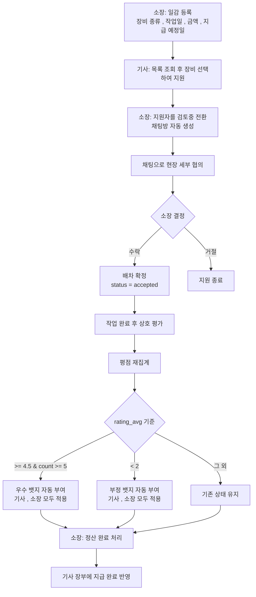
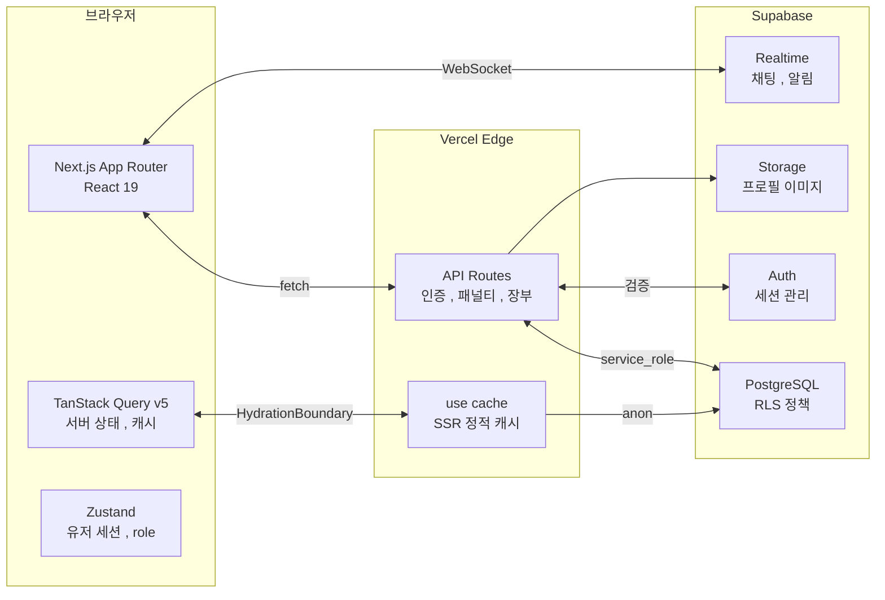
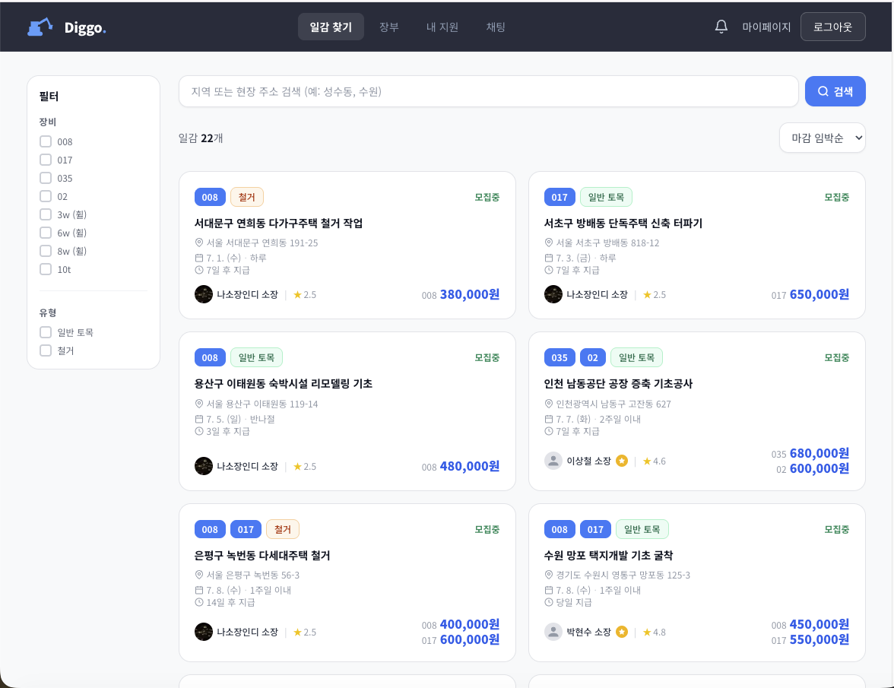
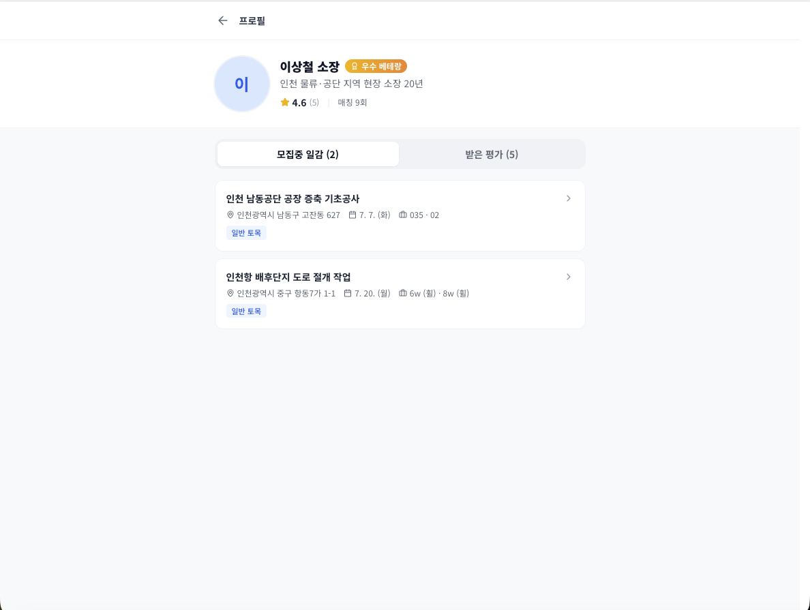
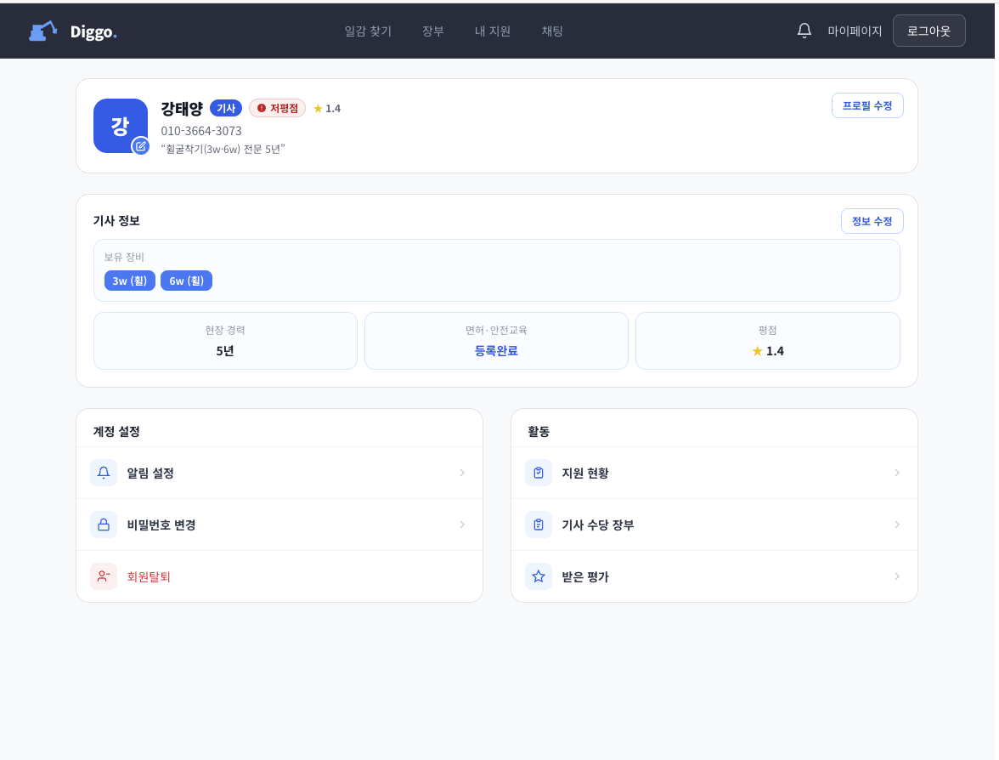
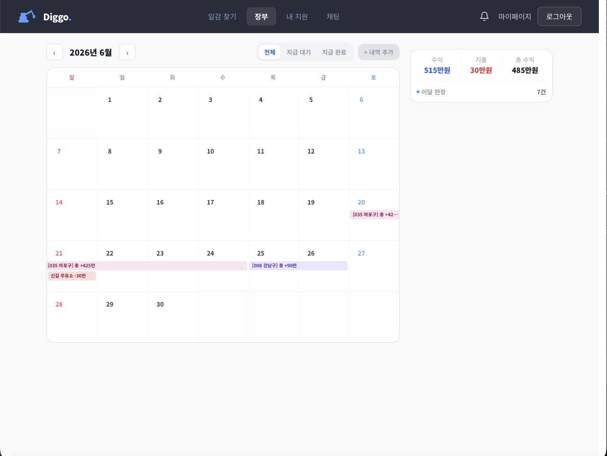
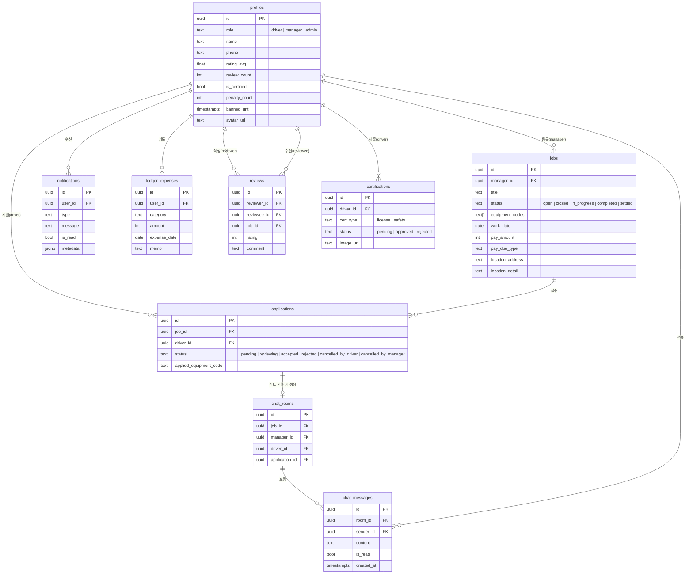
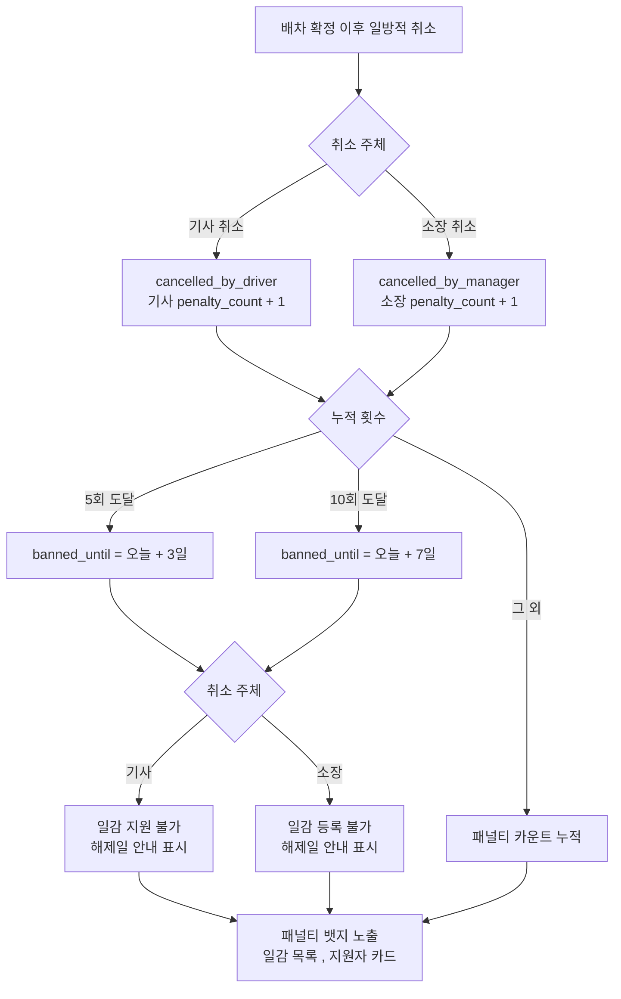

# Diggo

굴착기 기사와 소장을 연결하는 배차 플랫폼입니다. 배차 확정 이후 일방적 취소에는 패널티가 부과되고, 작업이 완료되면 장부에 금액이 자동으로 기록됩니다.

**배포 링크**: https://diggo.vercel.app/

---

## 개발 배경

굴착기 기사와 소장을 모두 경험한 입장에서 이 플랫폼이 왜 필요한지는 몸으로 먼저 알았습니다.

기사로 일할 때 불합리하다고 느낀 건 두 가지였습니다. <br/>
하나는 대금 문제입니다. 며칠씩 작업했는데 "다음 달에 준다", "이번 달은 좀 어렵다"는 말이 반복됐습니다. <br/>
소장과 아는 사이면 눈치껏 기다리게 되고, 모르는 사이면 독촉하기도 눈치가 보였습니다. 
<br/>
<br/>다른 하나는 나이 문제입니다. 실력은 충분한데 어려 보인다는 이유만으로 일감을 받지 못한 적이 있었습니다. <br/>
검증할 방법이 없으니 소장 입장에서는 모르는 젊은 기사를 일단 꺼리게 됩니다.

소장 쪽에서는 다른 불안이 있었습니다. 경력을 부풀려 들어오는 기사가 종종 있었습니다. 
좁은 골목 진입이나 장비 조작 숙련도는 현장에서 직접 보기 전까지는 알 방법이 없고, 사고가 나면 결국 소장이 책임을 지는 구조였습니다. 거기에 노쇼까지 더해지면 하루가 통째로 무너졌습니다. 
<br/>대체 기사를 급하게 섭외하거나 일정을 미뤄야 했습니다.

기사와 소장이 공통으로 겪는 문제는 수기 장부였습니다. 
<br/>날짜, 기사 이름, 금액을 노트에 손으로 적고 월말에 합산하는 방식이 현장에서는 여전히 흔합니다. 
<br/>기사 여럿을 쓰는 현장에서 수기로 관리하면 실수가 잦을 수밖에 없고, 기사도 자신이 언제 얼마를 받아야 하는지 따로 메모해두지 않으면 나중에 확인이 어려웠습니다.

개발을 공부하면서 이 문제들을 시스템으로 풀어보고 싶었습니다. 
<br/>평점과 인증 이력이 쌓이면 나이와 상관없이 실력으로 평가받을 수 있고, 정산 내역이 장부에 자동으로 올라가면 대금 분쟁도 줄어들 것이라고 봤습니다. 그래서 배차 확정 후 일방적 취소에 제재가 붙는 구조도 넣었습니다. <br/>**Diggo**는 거기서 출발했습니다.

---

## 프로젝트 소개

| 항목 | 내용 |
|------|------|
| 배포 URL | https://diggo.vercel.app/|
| 개발 기간 | 2026.03 ~ 2026.06 |
| 개발 인원 | 1인 (풀스택 -> 백엔드는 supabase 이용) |

**테스트 계정**

| 역할 | 이메일 | 비밀번호 |
|------|--------|---------|
| 기사 | test@naver.com | test1234! |
| 소장 | manager1234@naver.com | manager1234! |
| 관리자 | admin1234@naver.com | admin1234! |

**서비스 흐름**



**시스템 아키텍처**



---

## 주요 기능 시연

### A. 일감 목록

장비 종류, 일감 유형 필터와 마감임박순 정렬로 원하는 일감을 빠르게 탐색할 수 있습니다. 공개 일감 데이터는 `"use cache"`로 서버 캐싱되어 반복 진입 시 DB를 조회하지 않습니다. 사용자별 지원 버튼과 소장 전용 액션은 클라이언트에서 분리 렌더링됩니다.



---

### B. 평점 기반 자동 뱃지

리뷰가 쌓일 때마다 서버에서 평점을 재집계합니다. `rating_avg >= 4.5 && review_count >= 5`를 충족하면 우수 뱃지가, `rating_avg <= 2.0 && review_count >= 5`이면 저평점 뱃지가 프로필에 자동으로 표시됩니다. 관리자 승인 없이 동작하며 기사와 소장 모두에게 적용됩니다.





---

### C. 통합 현장 장부

배차가 완료된 일감의 지급 금액이 수입으로 자동 집계되고, 유류비 등 현장 지출은 직접 입력합니다. 달력에는 일별 수입·지출 리본이 표시되고, 우측 요약 카드에서 월간 수익·지출·순수익을 한눈에 확인할 수 있습니다.



---

## 기술 스택

**프레임워크 , 언어**

  

**스타일**


**백엔드 , 데이터베이스**

 

**상태 관리**

 

**인프라 , 도구**

   

| 분류 | 기술 | 선택 이유 |
|------|------|----------|
| 프레임워크 | Next.js 16 (App Router) | `cacheComponents: true` 기반 PPR(Partial Prerender)을 지원합니다. 공개 일감 목록은 정적 캐시로 제공하고, 사용자별 UI는 클라이언트에서 분리 처리합니다 |
| 언어 | TypeScript (strict) | 역할별 타입(`driver`, `manager`, `admin`), 일감 상태 타입(`ApplicationStatus`), 패널티 임계값 상수(`PENALTY_BAN_THRESHOLDS`) 등 도메인 규칙을 타입 레벨에서 강제합니다 |
| 스타일 | Tailwind CSS | 모바일 반응형 레이아웃을 빠르게 구성할 수 있고, 조건부 클래스만으로 상태 기반 UI 분기를 처리할 수 있어서 선택했습니다 |
| 데이터베이스 | Supabase (PostgreSQL) | RLS 정책으로 역할별 데이터 접근을 DB 레벨에서 통제합니다. `CHECK` 제약 조건으로 허용되지 않은 상태값을 DB 단에서 차단합니다 |
| 실시간 | Supabase Realtime | 채팅 메시지, 알림, 읽음 처리를 WebSocket으로 구현합니다. 채팅방마다 고유 채널명을 부여해 싱글톤 캐시 충돌을 막습니다 |
| 서버 상태 | TanStack Query v5 | 일감 목록 무한스크롤, 낙관적 업데이트(장부 지출), `HydrationBoundary` 패턴으로 SSR 워터폴을 방지합니다 |
| 클라이언트 상태 | Zustand | 유저 세션과 역할(role)을 전역에서 단일 구독합니다. `AuthInitializer` 패턴으로 앱 전체에서 한 번만 구독합니다 |
| 런타임/패키지 | Bun | npm 대비 설치 속도가 최대 25배 빠릅니다. 로컬 개발 환경 부트스트랩 시간을 단축합니다 |
| 지도 | 카카오맵 API | 국내 도로명 주소 정확도가 높습니다. REST API 키는 서버 전용 환경변수로 분리하여 클라이언트 노출을 차단합니다 |
| 테스트 | Python Playwright | 4개 역할(기사/소장/관리자/비로그인) 모바일 뷰포트(390x844) 전수 검사를 수행합니다. 콘솔 에러, 접근성(WCAG), 가로 오버플로우를 자동 감지합니다 |
| 배포 | Vercel | main 브랜치 자동 배포, Edge Network CDN, 환경변수 격리를 제공합니다 |

---

## 데이터베이스 설계 (ERD)



**설계 의도**

`applications.status`에 `cancelled_by_driver`와 `cancelled_by_manager`를 별도 값으로 두어 취소 주체를 DB 레벨에서 구분합니다. 취소가 발생하면 PATCH 요청 한 번으로 상태 변경과 패널티 부여가 트랜잭션처럼 처리됩니다.

`reviews` 테이블은 `(reviewer_id, reviewee_id, job_id)` 조합에 UNIQUE 제약을 두어 동일 일감에 대한 이중 평가를 DB에서 차단합니다. PostgREST가 동일 테이블을 두 개의 FK로 참조할 때 관계를 특정하지 못하는 문제가 있어, 리뷰 데이터는 별도 쿼리 후 JavaScript에서 수동으로 병합합니다.

---

## 핵심 비즈니스 로직

### 1. 노쇼 패널티 및 자동 이용 제한 시스템

배차가 확정된(`accepted`) 이후의 일방적 취소에만 패널티를 부과합니다. `pending`이나 `reviewing` 단계의 취소는 정상적인 배차 과정의 일부이므로 제재를 가하지 않습니다.

패널티 누적 및 이용 제한 로직 (`app/api/applications/[id]/cancel/route.ts`)

```typescript
// types/index.ts
export const PENALTY_BAN_THRESHOLDS: Record<number, number> = { 5: 3, 10: 7 }
// 5회 누적 → 3일 이용 제한, 10회 누적 → 7일 이용 제한

// cancel API
const newCount = (currentProfile?.penalty_count ?? 0) + 1
const banDays = PENALTY_BAN_THRESHOLDS[newCount]
const updateData: Record<string, unknown> = { penalty_count: newCount }

if (banDays) {
  updateData.banned_until = new Date(Date.now() + banDays * 86400000).toISOString()
}

await admin.from('profiles').update(updateData).eq('id', cancelUserId)
```



`PENALTY_BAN_THRESHOLDS`는 `types/index.ts`에 단일 상수로 정의되어 서버(cancel API)와 클라이언트(ban UI) 양쪽에서 동일하게 씁니다. 임계값이 바뀌어도 한 곳만 수정하면 됩니다.

제한 중인 사용자가 지원이나 일감 등록을 시도하면 서버에서 403을 반환하고, 클라이언트는 `banned_until` 날짜를 파싱하여 "N월 N일까지 제한됩니다" 안내를 표시합니다. 서버와 클라이언트 양측에서 동시에 검증합니다.

---

### 2. 통합 현장 장부 시스템

기사와 소장의 장부 구조는 다르게 설계했습니다.

기사는 배차가 완료된 일감의 지급 금액이 수입으로 자동 집계되고, 유류비 등 지출은 직접 입력합니다. 소장은 배차한 기사별 지급 금액 합산이 지출로 잡히고, 수주 금액에서 이를 빼면 마진이 계산됩니다.

`ledger_expenses` 테이블 하나에 수입과 지출을 함께 저장합니다. `category = '수입'`으로 저장된 항목이 수동 수입이고, 나머지는 지출입니다. 집계 로직에서 이를 분기 처리하는 곳이 세 군데인데(`buildMonthData`, `computePanelNet`, `summaryValues`), 한 곳만 고치면 다른 화면의 수치가 달라지는 문제가 생겨서 반드시 세 곳을 동시에 수정해야 합니다.

달력 셀 금액 포맷 (`lib/utils/ledger.ts`)

```typescript
export function formatCellBadge(amount: number): string {
  const abs = Math.abs(amount)
  const sign = amount >= 0 ? '+' : '-'
  if (abs >= 100_000_000) return `${sign}${(abs / 100_000_000).toFixed(1)}억`
  if (abs >= 10_000) return `${sign}${Math.round(abs / 10_000)}만`
  return `${sign}${abs.toLocaleString()}`
}
```

달력 셀은 공간이 협소해서 "1,200,000원"을 그대로 표시하면 레이아웃이 무너집니다. 셀에는 "120만", 상세 패널에는 전체 금액을 표시하는 방식으로 분리했습니다.

---

### 3. 우수 기사 평점 자동 인증

리뷰가 등록될 때마다 해당 피평가자의 전체 리뷰를 재집계합니다. 조건을 충족하면 `is_certified`가 자동으로 `true`가 되고, 관리자의 수동 승인 없이 작동합니다.

자동 인증 트리거 (`app/api/reviews/route.ts`)

```typescript
// types/index.ts에 상수로 정의
export const CERT_AUTO_MIN_RATING = 4.5
export const CERT_AUTO_MIN_REVIEWS = 5

// 리뷰 등록 성공 후 대상자 평점 재집계
const { data: allRatings } = await supabase
  .from('reviews')
  .select('rating')
  .eq('reviewee_id', reviewee_id)

const count = allRatings?.length ?? 0
const avg = count > 0
  ? Math.round((allRatings!.reduce((sum, r) => sum + r.rating, 0) / count) * 100) / 100
  : 0

const shouldAutoCertify = avg >= CERT_AUTO_MIN_RATING && count >= CERT_AUTO_MIN_REVIEWS

await supabase
  .from('profiles')
  .update({
    rating_avg: avg,
    review_count: count,
    ...(shouldAutoCertify ? { is_certified: true } : {}),
  })
  .eq('id', reviewee_id)
```

평점이 낮아지더라도 한 번 부여된 인증이 자동으로 취소되지는 않습니다. 인증 취소는 관리자가 직접 처리하는 방식으로 분리해두었습니다.

---

### 4. 실시간 알림 레이어

알림은 Supabase Realtime의 `INSERT` 이벤트를 구독하여 새로고침 없이 수신합니다. 
<br/>앱 전체에서 단 한 번만 구독하도록 `AuthInitializer` 컴포넌트에서 `useNotifications` 훅을 초기화하고, 나머지 컴포넌트는 Zustand 스토어에서 카운트만 읽습니다.

패널티 뱃지는 Realtime과 별개로, `profiles.penalty_count`를 일감 목록(`JobCard`), 일감 상세(`ManagerBlock`), 지원자 목록(`ApplicantCard`), 마이페이지(`InlineProfileCard`) 네 곳의 쿼리에 포함시켜서 페이지 진입 시점에 표시합니다.

---

## 성능 최적화

### 일감 목록: SSR + Next.js 16 캐시 레이어 분리

Next.js 16의 `cacheComponents: true` 모드에서 `"use cache"` 디렉티브를 사용해 일감 목록 첫 페이지를 서버에서 캐싱합니다.

```typescript
// lib/utils/jobs-cache.ts
export async function getCachedJobsFirstPage() {
  'use cache'
  cacheLife('seconds')  // 30초 TTL
  cacheTag('jobs')

  const supabase = createPublicClient()  // cookies() 없는 공개 클라이언트
  return supabase
    .from('jobs')
    .select('*, profiles(id, name, rating_avg, review_count, is_certified, avatar_url, penalty_count)')
    .eq('status', 'open')
    .gte('work_date', new Date().toISOString().split('T')[0])
    .order('work_date', { ascending: true })
    .limit(10)
}
```

`/jobs` 페이지는 빌드 시 `Static`으로 렌더링됩니다. 
<br/>사용자별 지원 버튼과 소장 전용 액션은 `UserJobSection`에서 `'use client'`와 `useAuthStore`로 클라이언트 사이드에서 분리 처리합니다. <br/>
일감 등록이나 수정이 발생하면 `revalidateTag('jobs', 'max')`로 캐시를 즉시 무효화합니다.

### 일감 상세: Partial Prerender (PPR)

`/jobs/[id]` 페이지는 빌드 결과가 `◐ (Partial Prerender)` 상태입니다. 공개 일감 정보는 `cacheLife('minutes')`로 서버 캐싱되고, 지원 버튼과 배차 현황은 클라이언트에서 마운트 후 렌더링됩니다.

`await params`를 포함하는 async 서버 컴포넌트가 PPR 빌드에서 Suspense 경계 없이 렌더링되면 빌드가 실패합니다. sync 외부 컴포넌트에서 `<Suspense>` 래퍼를 만들고, async 로직은 내부 컴포넌트로 분리하는 방식으로 해결했습니다.

```tsx
// 외부: sync 컴포넌트 (Suspense 래퍼)
export default function JobDetailPage({ params }: Props) {
  return (
    <Suspense fallback={<div className="min-h-screen bg-gray-50" />}>
      <JobDetailContent params={params} />
    </Suspense>
  )
}

// 내부: async 컴포넌트
async function JobDetailContent({ params }: Props) {
  const { id } = await params
  const job = await getCachedJobDetail(id)
  return <div>...</div>
}
```

### 장부 지출 추가: 낙관적 업데이트

지출 항목을 추가할 때 서버 응답을 기다리지 않고 UI를 먼저 갱신합니다. 실패하면 이전 상태로 자동 복원됩니다.

```typescript
// hooks/useLedger.ts
useMutation({
  mutationFn: (expense) => fetch('/api/ledger/expenses', { method: 'POST', body: JSON.stringify(expense) }),
  onMutate: async (newExpense) => {
    await queryClient.cancelQueries({ queryKey: ['ledger', year, month] })
    const previous = queryClient.getQueryData(['ledger', year, month])
    queryClient.setQueryData(['ledger', year, month], (old: LedgerData) => ({
      ...old,
      expenses: [...old.expenses, { ...newExpense, id: `temp-${Date.now()}` }],
    }))
    return { previous }
  },
  onError: (_err, _vars, context) => {
    queryClient.setQueryData(['ledger', year, month], context?.previous)
  },
  onSettled: () => {
    queryClient.invalidateQueries({ queryKey: ['ledger', year, month] })
  },
})
```

### 초기 데이터 로딩: HydrationBoundary 패턴

일감 목록 페이지에서 클라이언트가 마운트되기 전에 첫 페이지 데이터를 서버에서 미리 채웁니다. 
<br/>이 방식으로 초기 로드 시 로딩 스피너가 나타나지 않고, TanStack Query가 캐시된 데이터를 즉시 사용합니다.

```typescript
// app/jobs/page.tsx (Server Component)
const queryClient = new QueryClient()

await queryClient.prefetchInfiniteQuery({
  queryKey: ['jobs', DEFAULT_FILTERS],
  queryFn: ({ pageParam = 0 }) => fetchCachedJobsPage(pageParam),
  initialPageParam: 0,
  getNextPageParam: (lastPage, pages) => lastPage.hasMore ? pages.length : undefined,
})

return (
  <HydrationBoundary state={dehydrate(queryClient)}>
    <JobList />
  </HydrationBoundary>
)
```

---

## 보안 설계

### Supabase RLS (Row Level Security)

역할별 데이터 접근 제어는 애플리케이션 레이어가 아닌 DB 레벨에서 처리합니다. 
<br/>클라이언트가 직접 Supabase를 호출하더라도 RLS 정책이 없으면 데이터에 접근할 수 없습니다.

주요 정책:

- `jobs` 테이블: `status = 'open'`인 일감은 누구나 읽을 수 있지만, 등록은 `role = 'manager'`인 사용자만 가능합니다.
- `applications` 테이블: 기사는 본인이 지원한 행만 읽을 수 있고, 소장은 자신이 올린 일감에 지원한 행만 읽을 수 있습니다.
- `profiles` 테이블: 본인 행만 UPDATE 가능합니다.

패널티 부여나 인증 승인처럼 RLS를 우회해야 하는 서버 전용 작업은 `service_role` 키를 사용하는 `createAdminClient()`를 통해서만 처리합니다. 이 클라이언트는 API Route 서버 환경에서만 사용하며 클라이언트 번들에 포함되지 않습니다.

```typescript
// lib/supabase/admin.ts
export function createAdminClient() {
  return createClient(
    process.env.NEXT_PUBLIC_SUPABASE_URL!,
    process.env.SUPABASE_SERVICE_ROLE_KEY!,  // NEXT_PUBLIC_ 없음, 서버 전용
  )
}
```

### API Route 인증 및 환경변수 관리

모든 데이터 변경 API Route는 요청 초입에 `supabase.auth.getUser()`로 세션을 검증합니다. 세션이 없으면 즉시 401을 반환합니다. 역할이 필요한 엔드포인트(일감 등록, 배차 취소, 패널티 부여 등)는 추가로 `profiles.role`을 확인합니다.

카카오 REST API 키는 `KAKAO_REST_API_KEY`로 서버 전용 환경변수에 저장합니다. 클라이언트가 직접 호출하는 대신 `/api/address/search` API Route를 프록시로 두는 이유는 `NEXT_PUBLIC_` 접두사가 붙은 환경변수는 브라우저 번들에 포함되기 때문입니다.

---

## 기술적 도전 및 트러블슈팅

### 1. LCP 9.0s → 4.4s: SSR 캐시 부재와 리전 불일치로 인한 초기 로딩 지연

배포 후 Lighthouse로 측정하니 LCP가 9.0s였습니다. 원인은 두 가지가 겹쳤습니다.
<br/>첫째, 일감 목록 페이지 진입마다 캐시 없이 Supabase를 3회 조회했습니다 (일감 목록, 총 개수, 사용자 프로필).
<br/>둘째, Vercel 배포 리전이 미국 동부였고 Supabase DB는 서울이었습니다. 왕복 지연이 쿼리마다 200~300ms씩 누적되어 세 쿼리만으로 최소 600~900ms가 소요됐습니다.

```typescript
// 변경 전: 매 요청마다 캐시 없이 Supabase 3회 조회
// Vercel(미국 동부) ↔ Supabase(서울) 왕복 지연 200~300ms × 3 = 600~900ms 누적
```

세 가지를 함께 적용했습니다. `"use cache"` + `cacheLife('seconds')` + `cacheTag('jobs')`로 공개 일감 데이터를 서버 캐싱해 반복 요청 시 DB를 조회하지 않도록 했습니다. `vercel.json`의 배포 리전을 `icn1`(인천)으로 전환해 Supabase와의 왕복 지연을 수십 ms 수준으로 단축했습니다. Next.js 16 `cacheComponents: true`로 PPR을 활성화해 캐시된 정적 쉘을 즉시 응답하도록 했습니다.

```typescript
// 변경 후: "use cache"로 서버 캐싱, 리전 icn1 전환
export async function getCachedJobsFirstPage() {
  'use cache'
  cacheLife('seconds')  // 30초 TTL
  cacheTag('jobs')
  // 반복 요청은 DB 조회 없이 캐시에서 응답
}
```

Lighthouse 재측정 결과 LCP 9.0s → 4.4s (51% 감소), TBT 70ms → 0ms, Performance 점수 73 → 83으로 개선됐습니다.

---

### 2. 채팅 목록 N+1 쿼리: 배차 채팅방이 늘수록 목록 로딩이 선형으로 느려지는 문제

배차 협의 채팅방이 늘어날수록 채팅 목록 진입이 느려졌습니다. 코드를 보니 채팅방 목록을 조회한 뒤 각 방마다 마지막 메시지와 미읽음 수를 개별 쿼리로 추가 호출하는 구조였습니다. N개 방에서 2N+4번 DB를 호출하는 N+1 패턴이었습니다.

```typescript
// 변경 전: 방마다 개별 쿼리 (N개 방 → 2N+4번 DB 호출)
enriched = await Promise.all(
  rooms.map(async (room) => {
    const [{ data: lastMsgs }, { count: unread }] = await Promise.all([
      supabase.from('chat_messages').select('...').eq('room_id', room.id).limit(1),
      supabase.from('chat_messages').select('*', { count: 'exact', head: true }).eq('room_id', room.id).eq('is_read', false),
    ])
    return { ...room, last_message: lastMsgs?.[0], unread_count: unread ?? 0 }
  })
)
```

전체 채팅방 ID를 수집해 마지막 메시지와 미읽음 수를 IN절 단일 쿼리로 일괄 조회하고, 결과를 `room_id` 기준 Map으로 변환해 O(1)로 조립하는 방식으로 교체했습니다. 서버 로그에 카운터를 추가해 실측했고, 방 개수와 무관하게 6개 고정임을 확인했습니다.

```typescript
// 변경 후: IN절 일괄 조회 후 Map 조립 (채팅방 수와 무관하게 6개 고정)
const roomIds = rooms.map((r) => r.id)
const [{ data: allMessages }, { data: allUnread }] = await Promise.all([
  supabase.from('chat_messages').select('id, room_id, message, sender_id, created_at, is_deleted')
    .in('room_id', roomIds).order('created_at', { ascending: false }),
  supabase.from('chat_messages').select('room_id')
    .in('room_id', roomIds).eq('is_read', false).neq('sender_id', user.id),
])

const lastMsgMap = new Map<string, LastMsg>()
for (const msg of allMessages ?? []) {
  if (!lastMsgMap.has(msg.room_id)) lastMsgMap.set(msg.room_id, msg)
}
const unreadMap = new Map<string, number>()
for (const msg of allUnread ?? []) {
  unreadMap.set(msg.room_id, (unreadMap.get(msg.room_id) ?? 0) + 1)
}
```

채팅방 수가 늘어도 쿼리 수가 6개로 고정되어 로딩 시간이 선형 증가하지 않습니다. 배차가 활발한 소장 계정일수록 절감 효과가 커지는 구조입니다 (N=10 기준 24→6, 75% 감소).

---

### 3. 정산 장부 수입 집계 버그: 수동 수입이 지출로 집계되는 오류

기사가 전자 장부에 현장 수입을 직접 입력하면 월간 요약 카드에서 수입이 지출로 표시되는 버그가 있었습니다. `ledger_expenses` 테이블에 수입과 지출을 `category` 값으로 구분해 함께 저장하는 구조인데, 집계 로직이 `buildMonthData`, `computePanelNet`, `summaryValues` 세 곳에 분산되어 있었습니다. 한 곳만 수정하면 나머지 화면에서 수치가 또 달라지는 구조적 문제였습니다.

```typescript
// 변경 전: category 구분 없이 무조건 totalExpense에 가산
day.totalExpense += Number(entry.amount) || 0
```

세 곳 모두에 `category === '수입'` 분기를 추가해 동시에 수정했습니다. `computePanelNet`에서는 수동 수입(`manualInc`)을 별도 집계 후 순수익 계산에 포함하고, `summaryValues`의 income·net 계산에도 동일하게 반영했습니다.

```typescript
// 변경 후: category === '수입'이면 totalIncome에 가산 (세 곳 동시 적용)
if (entry.category === '수입') {
  day.totalIncome += Number(entry.amount) || 0
} else {
  day.totalExpense += Number(entry.amount) || 0
}
```

월간 요약 카드, 날짜 패널, 달력 배지 세 화면의 수입·지출·순수익 수치가 모두 일치하게 정상화됐습니다. 수입·지출을 같은 테이블에 저장하는 구조에서는 집계 로직이 분산된 모든 지점을 동시에 수정해야 한다는 패턴을 문서화했습니다.

---

## 코드 품질 개선

기능 구현 이후 코드베이스 전체를 보안, 접근성, 중복 세 방향으로 검토했습니다.

---

### API 보안: 요청 바디 필드 주입 차단

지출 등록 API에서 `const body = await request.json()` 후 `insert({ ...body, driver_id: user.id })`로 그대로 전달하고 있었습니다. 
<br/>`driver_id`를 body에 포함해 전송하면 다른 사용자의 ID로 덮어쓸 수 있는 구조였습니다.

```typescript
// 변경 전: body 전체를 spread하면 임의 필드 주입 가능
const body = await request.json()
supabase.from('ledger_expenses').insert({ ...body, driver_id: user.id })

// 변경 후: 허용된 필드만 destructure
const { category, amount, expense_date, memo } = await request.json()
supabase.from('ledger_expenses').insert({ category, amount, expense_date, memo, driver_id: user.id })
```

RLS 정책이 있더라도 애플리케이션 레이어에서 먼저 걸러내는 것이 원칙입니다. 
<br/>모든 POST/PATCH API Route에서 바디 필드를 명시적으로 destructure하도록 교체했고, `try/catch` 없이 외부 API를 호출하던 엔드포인트에도 에러 핸들링을 추가했습니다.

---

### 접근성: WCAG 2.5.5 터치 타겟 기준 적용

모바일 사용자 비중이 높은 서비스 특성상 터치 타겟 크기를 점검했습니다. -> WCAG 2.5.5는 대화형 요소의 최소 터치 타겟을 44 x 44px로 권장합니다.

| 컴포넌트 | 변경 전 | 변경 후 |
|----------|---------|---------|
| NavButtons 햄버거 버튼 | 36x36px | 44x44px |
| MonthPicker 연도 이동 버튼 | 32x32px | 40x40px |
| LedgerCalendar 날짜 배지 | 24x24px | 28x28px |

스크린 리더 대응도 함께 처리했습니다. 
<br/>`JobStatusBadge` 드롭다운에 `aria-expanded`, `aria-haspopup="listbox"`, 옵션 항목에 `role="option"` + `aria-selected`를 추가했습니다. 
<br/>햄버거 버튼에는 `aria-expanded`와 `aria-haspopup="menu"`를 달았고, MonthPicker 이전/다음 버튼에는 `aria-label`을 넣었습니다.

채팅 입력창(`ChatInput`)의 `<textarea>`처럼 시각적 레이블만 있고 `<label>` 연결이 없는 폼 요소에는 `sr-only` 레이블을 추가했습니다. 
<br/>`AddExpenseModal`은 열릴 때 금액 입력 필드로 포커스가 자동 이동하고, 닫힐 때 트리거 버튼으로 포커스가 복원되도록 `prevFocusRef` 패턴을 적용했습니다.

---

### 컴포넌트 설계: useJobForm 훅 분리

`JobForm.tsx`는 556줄짜리 파일이었고, 폼 상태 관리, 유효성 검사, API 호출, 라우팅, UI 렌더링이 한 컴포넌트 안에 섞여 있었습니다.

submit 로직과 폼 상태를 `hooks/useJobForm.ts`로 분리했습니다. 훅이 `form`, `set`, `toggleEquipment`, `setPayment`, `isValid`, `isSubmitting`, `handleSubmit`을 반환하고, `JobForm.tsx`는 UI 렌더링에만 집중합니다. 파일 크기는 556줄에서 375줄로 줄었습니다.

```typescript
// hooks/useJobForm.ts
export function useJobForm({ mode, jobId, initialValues }: UseJobFormOptions) {
  const [form, setForm] = useState<FormState>(...)
  const [isSubmitting, setIsSubmitting] = useState(false)

  async function handleSubmit() {
    // 유효성 검사, API 호출, 라우팅 처리
  }

  return { form, set, toggleEquipment, setPayment, isValid, isSubmitting, handleSubmit }
}

// JobForm.tsx
export function JobForm({ mode, jobId, initialValues }: JobFormProps) {
  const { form, set, ..., handleSubmit } = useJobForm({ mode, jobId, initialValues })
  // UI만 담당
}
```

---

### 타입 안전성: 이중 캐스팅 제거

Supabase PostgREST join이 반환하는 타입이 SDK의 추론 타입과 실제 런타임 형태 사이에 차이가 있을 때, `as unknown as TargetType` 형태의 이중 캐스팅으로 타입 오류를 회피하고 있는 곳이 2개 있었습니다.

`daily/[date]/route.ts`에서는 Supabase가 `equipments`를 배열로 반환하지만 SDK 타입이 이를 정확히 추론하지 못해 이중 캐스팅이 필요했습니다. 쿼리 결과를 명시적으로 `.map()`으로 변환하고, `buildIncomeEntries`의 파라미터 타입을 `model_code: string`으로 완화한 뒤 함수 내부에서 `EquipmentCode`로 캐스팅하는 방식으로 이중 캐스팅을 제거했습니다.

`applicants/page.tsx`에서는 수동으로 조립한 객체에 `MappedApplication` 인터페이스를 명시하고, 렌더링 직전 `.filter((app) => app.profiles !== null)`로 null을 걸러낸 뒤 단일 캐스팅으로 교체했습니다. 
<br/>`as unknown as X`가 숨기던 실제 타입 불일치를 처리하는 과정이었습니다.

---

## 폴더 구조

```
diggo/
├── app/                          # Next.js App Router
│   ├── (auth)/                   # 로그인, 회원가입
│   ├── jobs/                     # 일감 목록, 상세, 등록
│   │   ├── [id]/
│   │   │   ├── page.tsx          # PPR — 공개 일감 정보
│   │   │   └── UserJobSection.tsx # 'use client' — 지원 버튼, 소장 액션
│   │   └── new/
│   ├── manager/                  # 소장 전용 (내 일감, 지원자 목록)
│   ├── mypage/                   # 마이페이지, 장부, 지원 내역
│   ├── chats/                    # 채팅 목록, 채팅방
│   ├── profiles/                 # 공개 프로필
│   ├── notifications/            # 알림
│   └── api/                      # API Routes
│       ├── jobs/
│       ├── applications/
│       │   └── [id]/cancel/      # 패널티 부여 엔드포인트
│       ├── chats/
│       ├── ledger/
│       ├── reviews/              # 평점 재집계 + is_certified 자동화
│       └── auth/
├── components/
│   ├── ui/                       # Avatar, EquipmentBadge, CertBadge, EmptyState
│   └── features/                 # 기능별 컴포넌트
│       ├── jobs/                 # JobCard, JobApplyButton, JobForm
│       ├── manager/              # ApplicantCard
│       ├── ledger/               # LedgerDayPanel, AddExpenseModal
│       ├── chat/                 # ChatRoom, ChatRoomMenu, ChatMessageBubble
│       └── mypage/               # InlineProfileCard, ReviewModal
├── hooks/
│   ├── useJobForm.ts             # 폼 상태 + submit 로직 훅 (JobForm에서 분리)
│   ├── useLedger.ts              # 장부 데이터 + 낙관적 업데이트
│   └── useHorizontalScroll.ts
├── lib/
│   ├── supabase/
│   │   ├── client.ts             # createBrowserClient
│   │   ├── server.ts             # createServerClient ('use no-store')
│   │   └── admin.ts              # createAdminClient (service_role)
│   ├── api/
│   │   └── auth.ts               # API Route 공통 인증 헬퍼
│   └── utils/
│       ├── date.ts               # getTodayStr, formatWorkDate 등 날짜 유틸 통합
│       ├── jobs-cache.ts         # "use cache" + cacheLife + cacheTag
│       └── ledger.ts             # formatKRW, buildMonthData, computePanelNet
├── store/
│   ├── auth.ts                   # useAuthStore (Zustand)
│   └── notification.ts           # useNotificationStore
└── types/
    └── index.ts                  # ApplicationStatus, PENALTY_BAN_THRESHOLDS,
                                  # CERT_AUTO_MIN_RATING, CERT_AUTO_MIN_REVIEWS
```

---

## 실행 방법

필수 환경변수 (`.env.local`)

```env
NEXT_PUBLIC_SUPABASE_URL=
NEXT_PUBLIC_SUPABASE_ANON_KEY=
SUPABASE_SERVICE_ROLE_KEY=
NEXT_PUBLIC_KAKAO_MAP_APP_KEY=
KAKAO_REST_API_KEY=
```

개발 서버 실행

```bash
bun install
bun dev
```

타입 체크

```bash
bun run type-check
```

프로덕션 빌드

```bash
bun run build
```

테스트 (Playwright)

```bash
pip install playwright
playwright install chromium
python test-results/e2e_full.py
```

---

## 개선 예정

| 기능 | 설명 |
|------|------|
| 장비 여러 대 운용 | 기사가 보유한 여러 장비에 담당자를 지정하고, 장비별 장부를 분리 관리 |
| 차고지 기준 거리 표시 | 일감 목록에서 내 차고지로부터의 거리를 카카오맵 API로 계산하여 표시 |
| 장부 Excel/PDF 내보내기 | 월별 장부를 종합소득세 신고용 양식으로 내보내기 |
| 체불 소장 블랙리스트 | 정산 지연 이력이 누적된 소장에게 경고 표시 |
| 관리자 v2 | 유저 계정 관리, 부적절 게시물 강제 마감, 통계 대시보드 |
