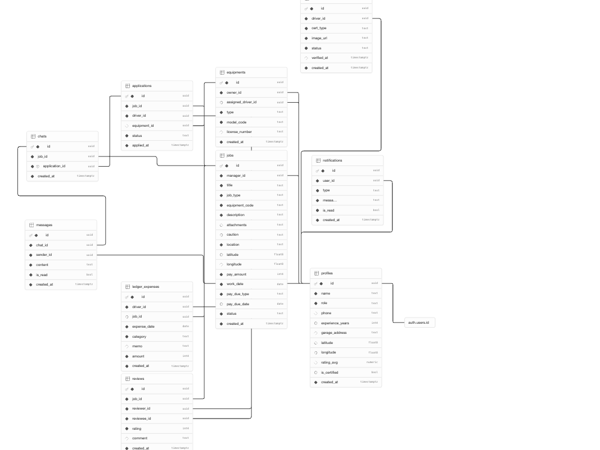

# Diggo

굴착기 기사와 소장을 연결하는 배차 플랫폼

## 기술 스택

- **Frontend**: Next.js 14 (App Router), TypeScript, Tailwind CSS
- **Backend**: Supabase (DB, Auth, Realtime, Storage)
- **상태관리**: Zustand (클라이언트), TanStack Query v5 (서버)
- **지도**: 카카오맵 API
- **배포**: Vercel

## 개발 환경

```bash
bun dev        # 개발 서버
bun run build  # 빌드
bun add <pkg>  # 패키지 설치
```

## ERD



### 테이블 구성

| 테이블 | 설명 |
|---|---|
| `profiles` | 기사 / 소장 사용자 정보 (auth.users 1:1 연결) |
| `equipments` | 굴착기 장비 정보 |
| `jobs` | 소장이 등록한 일감 |
| `applications` | 기사의 일감 지원 |
| `chats` | 기사-소장 채팅방 |
| `messages` | 채팅 메시지 |
| `reviews` | 작업 완료 후 상호 평가 |
| `ledger_expenses` | 기사 지출 장부 |
| `notifications` | 알림 |
